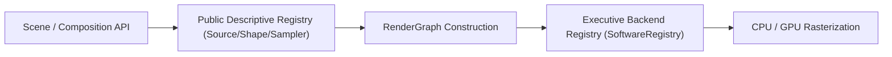

# Render Graph Specification

The Chronon3d Render Graph (`chronon3d::graph`) is a directed acyclic graph (DAG) representing the rendering pipeline for a single frame.

## Design Goals
1. **Caching**: Avoid redundant pixel work by hashing node inputs and parameters.
2. **Modularity**: Separate source rendering, effects, and compositing into reusable nodes.
3. **Parallelism**: Enable the `GraphExecutor` to process independent branches in parallel.

## Node Types
- **SourceNode**: Renders a primitive (Shape, Image, Text) into a new Framebuffer.
- **EffectNode**: Applies a post-processing effect (Blur, Tint, etc.) to an input Framebuffer.
- **CompositeNode**: Blends two or more Framebuffers using a `BlendMode`.
- **AdjustmentNode**: Applies a stack of effects to the accumulated result.
- **PrecompNode**: Executes a nested render graph (sub-composition).

## Caching Strategy

Caching is handled by the `GraphExecutor` using `chronon3d::cache::NodeCache`.

### NodeCacheKey
Each node generates a key based on:
- **Scope**: Node type identifier.
- **Frame**: Current timeline position.
- **Dimensions**: Target width and height.
- **Params Hash**: Hash of the node's internal state (e.g., shape properties, effect radius).
- **Input Hash**: Combined hash of the keys of all predecessor nodes.

**Crucial**: The `input_hash` ensures that if an upstream node changes, all downstream nodes are invalidated, preventing stale results.

### Cache Layers

The cache foundation introduces stable keys for two render scopes:

- **`NodeCache`**: Per-node caching within a frame.
- **`FrameCache`**: Cross-frame caching for precompositions and video.

Cache keys are based on stable hashes for:
- scope or composition identity
- frame number
- dimensions
- parameter hashes
- source hashes
- input hashes

### Direction
The next phase should wire these caches into:
- precomposition evaluation
- video decoding
- text layout caching
- node-level render reuse

## Coordinate Systems

The modular graph handles two distinct coordinate conventions:
1. **Screen Space (2D)**: Top-left origin (0,0). Used for standard UI-like layers.
2. **Projected Space (2.5D)**: Centered origin. Used when `enable_3d(true)` is set on a layer.

`SourceNodes` are responsible for applying the correct offsets based on the layer's projection mode.

## Registry Layer Architecture

The engine implements a decoupled dual-registry model:

### 1. Descriptive Public Registries (What exists)
Defined in `include/chronon3d/registry/`:
- **`SourceRegistry`**: Declares available media/image/video sources.
- **`ShapeRegistry`**: Declares valid geometric primitives.
- **`SamplerRegistry`**: Declares interpolation/sampling routines.
- **`EffectRegistry`**: Maps dynamic effect parameters to graph construction routines.

These registries define the descriptive blueprint of the composition and remain entirely backend-agnostic.

### 2. Executive Backend Registries (How to render)
Defined in the renderer backends (e.g., `SoftwareRegistry` in `SoftwareRenderer`):
- Map renderable shapes or effect variants directly to concrete CPU/GPU processors.

### Extending features
Adding a new shape or effect requires:
1. A descriptive registry declaration to make it visible.
2. A backend registry registration mapping the identifier to its execution processor.

---

## Effects System

Chronon3d treats effects as named, registrable units with stable IDs.

### Rules
- Every effect has a stable ID, a category, and a stage.
- Every concrete effect owns a typed params struct.
- New effects are registered through a registry.
- `SoftwareRenderer` does not gain ad-hoc effect implementations.
- Builder shortcuts are allowed only as convenience wrappers.

### Categories

| Category | Examples |
|----------|----------|
| `blur` | Gaussian |
| `color` | Tint, Brightness, Contrast |
| `light` | Drop Shadow, Glow |
| `stylize` | — |
| `distort` | — |
| `geometry` | — |
| `temporal` | — |
| `composite` | — |

### Stages
- `node`, `layer_pre_transform`, `layer_post_transform`, `adjustment`, `composition`, `temporal`

### Current Built-ins

Registered in `EffectRegistry`:
- `blur.gaussian`
- `color.tint`
- `color.brightness`
- `color.contrast`
- `light.drop_shadow`
- `light.glow`

These are registry-level definitions only — they establish taxonomy before deeper renderer integration.

### Direction
- Route `LayerBuilder` convenience methods through effect instances.
- Resolve layer effects via the registry.
- Add more effects only after the registry and descriptors stay stable.
